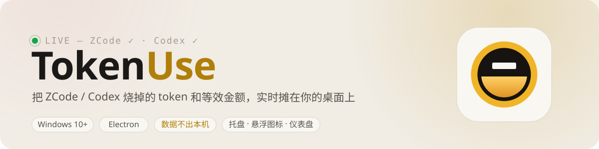
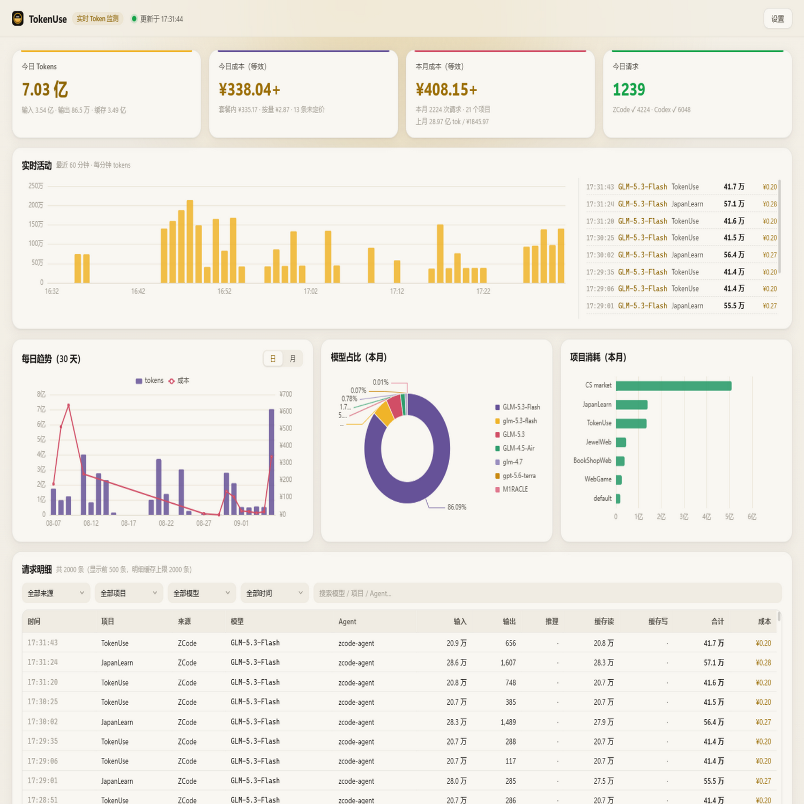
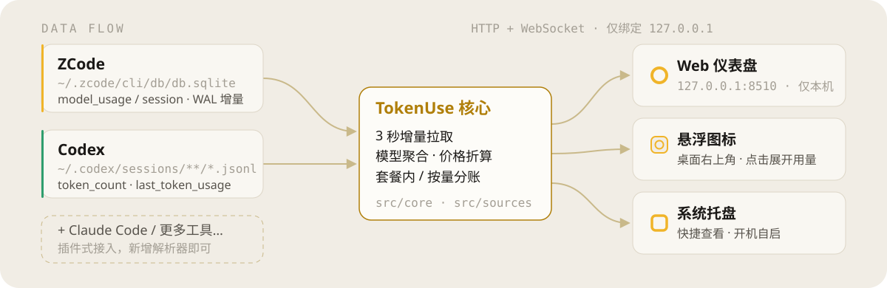

<p align="center">
  
</p>

<p align="center">
  <a href="https://github.com/Ageha6912/TokenUse/releases"></a>
  <a href="https://github.com/Ageha6912/TokenUse/blob/main/LICENSE"></a>
  
</p>

<p align="center">
  
</p>

## 这是什么

TokenUse 是一台跑在你电脑上的 **token 电表**：只读挂载 ZCode 的本地数据库、解析 Codex 的会话日志，每 3 秒增量拉取每一次模型请求，按价格表折算成等效金额，在 **Web 仪表盘 / 悬浮数字条 / 系统托盘** 三处常显。

数据全程留在本机，不经过任何第三方。金额是「等效成本」——按内置价格表折算，帮你心里有数，请按真实账单核价。

## 手机上实时查看

电脑跑着 TokenUse，手机连同一 Wi-Fi，扫码就能看同一份数据，刷新与 PC 同步：

1. PC 仪表盘 → 设置 → 「手机访问」→ 开启「局域网共享」
2. 手机相机扫二维码（地址已带访问令牌），或浏览器打开面板里的地址
3. iOS「添加到主屏幕」后即全屏独立窗口；令牌泄露时点「重置令牌」立即作废旧地址

安全默认：服务默认只监听本机回环；开启共享后才绑定局域网，且非本机请求必须携带令牌（静态页面除外，数据接口一律校验）。在外面（非同一 Wi-Fi）查看，可搭配 Tailscale 等组网工具访问同一地址，流量全程 WireGuard 加密。

## 工作原理

<p align="center">
  
</p>

- **只读采集**：不写入、不加锁；ZCode 侧监听 `db-wal` 变化做增量拉取，解析器失败会安全重试
- **统计口径统一**：总 tokens = 输入 + 输出 + 缓存读 + 缓存写（两家的 input 字段都不含缓存，口径一致）；推理 tokens 已含在输出里，单独展示不重复计
- **金额可核价**：缓存读按折扣价，按 `provider_id` 区分「套餐内 / 按量」，`builtin:zai-start-plan` 默认套餐内；匹配不到价格的模型金额显示 `—`，tokens 照常统计
- **数据源是插件**：要支持 Claude Code 等工具，在 `src/sources/` 新增一个解析器即可

## 下载安装

从 [Releases](https://github.com/Ageha6912/TokenUse/releases) 下载：

| 文件 | 说明 |
| --- | --- |
| `TokenUse-Setup-*.exe` | 安装版，装完自动启动，含开始菜单快捷方式 |
| `TokenUse-*.exe` | 便携版，单文件直接运行 |

首次运行如遇 SmartScreen 提示，点「更多信息 → 仍要运行」。需要本机装有 ZCode 或 Codex CLI 才有数据可看。

## 本地开发

```bash
npm install
npm run build
npm start        # 启动 Electron 应用：仪表盘窗口 + 托盘 + 悬浮数字条
```

也可以只跑监测服务（不开 Electron 壳），用浏览器访问 <http://127.0.0.1:8510>：

```bash
npm run server
```

<details>
<summary>目录结构</summary>

```
src/core/      类型、价格表、聚合器/存储
src/sources/   ZCode SQLite 与 Codex JSONL 数据源插件
src/server/    HTTP + WebSocket 实时服务（仅绑定 127.0.0.1）
electron/      托盘、悬浮数字条、仪表盘窗口
web/           仪表盘前端（原生 TS + ECharts）
scripts/       esbuild 构建与图标生成
```

</details>

## 配置文件（都在 `data/` 下，可直接编辑）

- `settings.json` — 轮询间隔（默认 3 秒）、美元汇率、各 provider 计费方式、悬浮条/开机自启/局域网共享（`lanAccess.enabled` + `lanAccess.token`）
- `prices.json` — 价格覆盖表（每 1M token，CNY/USD），优先级最高
- `remote-prices.json` — 从 LiteLLM 价格库拉取的远程价（设置里点按钮更新）

## 已知边界

- ZCode 的库是内部格式，若其升级改表结构，解析器会安全失败并在下轮重试；必要时删 `data/` 重启
- 请求明细最多缓存最近 2000 条（聚合数字不受影响，基于全量数据）
- 预算告警、历史导出、更多工具支持：二期候选

## License

[MIT](./LICENSE)
